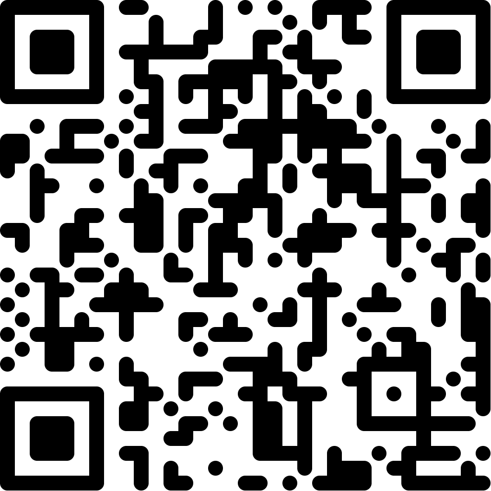

<div align="right">
  
</div>

# Context Engineering Workshop

A two-day hands-on workshop on context engineering for LLMs.

> **First time here?** Start with the [Prerequisites & Setup Guide](_requirements/README.md) to get your machine ready before the workshop.

## Repository Structure

```
day-1/
  01-foundations/        # What is context engineering, mental models
  02-prompt-design/      # Crafting effective prompts and instructions
  03-claude-md/          # CLAUDE.md files — project-level context
  04-system-prompts/     # System prompt design and patterns

day-2/
  05-tools-and-mcp/      # Tool design, MCP servers, function calling
  06-agentic-patterns/   # Multi-step agents, delegation, planning
  07-evaluation/         # Measuring and iterating on context quality
  08-capstone/           # Build and share your own context setup

examples/
  claude-md-templates/   # Ready-to-use CLAUDE.md templates
  prompt-patterns/       # Reusable prompt patterns and techniques
  mcp-configs/           # Example MCP server configurations
  system-prompts/        # Example system prompts

_requirements/           # Prerequisites and setup guide
resources/               # Reference materials, links, further reading
```

## Getting Started

```bash
git clone https://github.com/chriskehayias/ContextEngineering.git
cd ContextEngineering
```

Each module folder contains its own README with objectives, exercises, and materials.

## Resources

- [Claude Code Cheat Sheet](https://cc.storyfox.cz) — comprehensive reference for keyboard shortcuts, slash commands, workflows, tips, skills, agents, CLI flags, and more ([screenshot](resources/claude-code-cheat-sheet.png))
- [Brandfetch](https://brandfetch.com) — find official logos, icons, colors, and fonts for any company or product

## License

TBD
