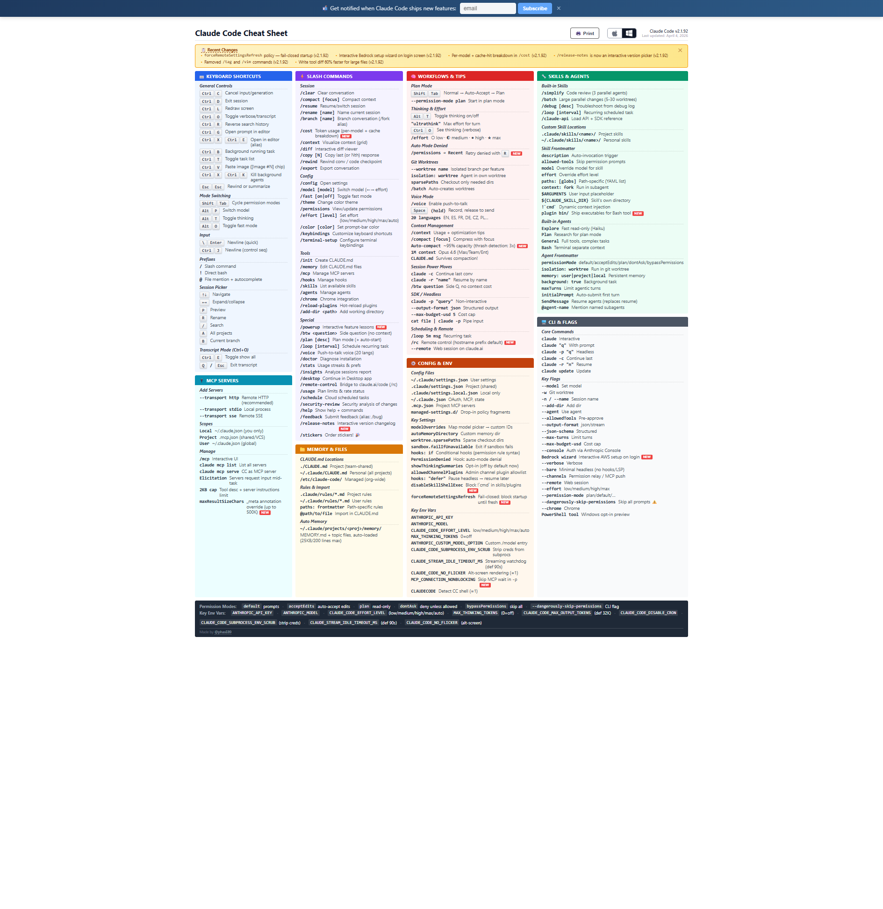

# Claude Code

## Claude Code Cheat Sheet

A comprehensive reference covering keyboard shortcuts, slash commands, workflows, tips, skills, agents, CLI flags, MCP servers, memory & files, config & env, and more.

**Link:** [https://cc.storyfox.cz](https://cc.storyfox.cz)

---

## Custom Status Line

A color-coded status line for Claude Code that displays model name, context window usage with a visual progress bar, token counts, session cost, project name, and git branch — all in one line. Includes the script and installation instructions.

**Link:** [statusline/README.md](statusline/README.md)

---
