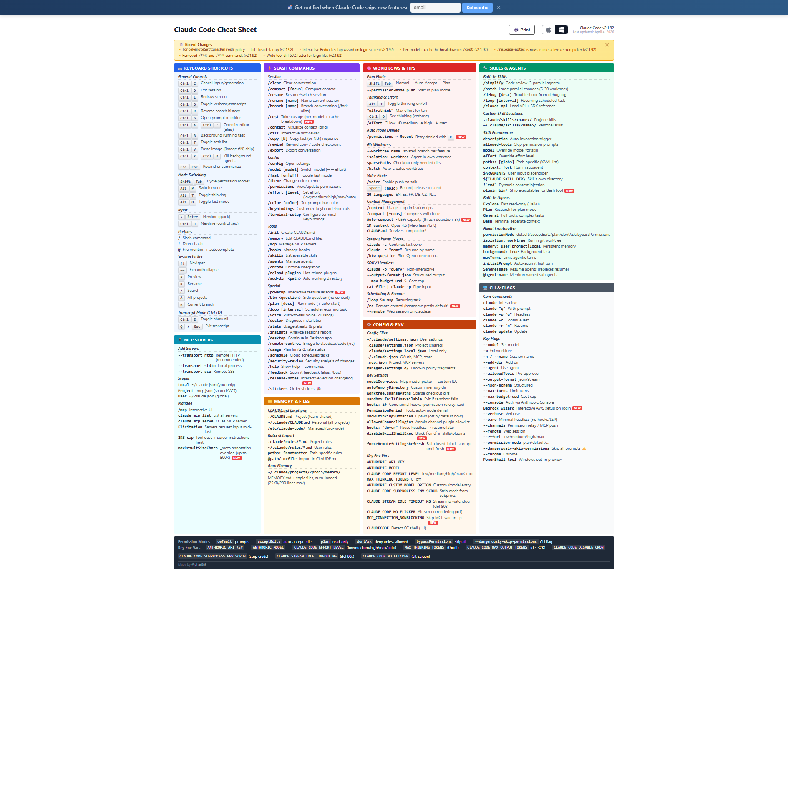

# Resources

## Claude Code Cheat Sheet

A comprehensive reference covering keyboard shortcuts, slash commands, workflows, tips, skills, agents, CLI flags, MCP servers, memory & files, config & env, and more.

**Link:** [https://cc.storyfox.cz](https://cc.storyfox.cz)

