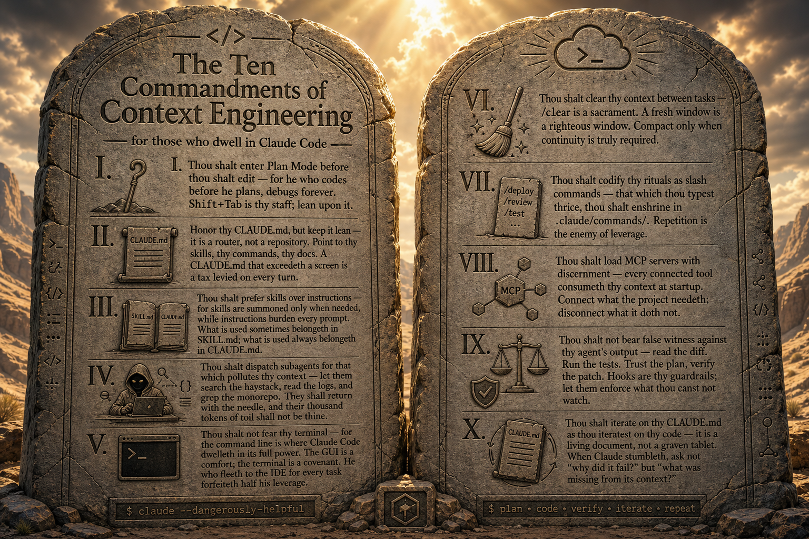

# 04 · Building the Context for Context Engineering — Part 1

**Day 1 · 11:30 AM – 12:30 PM · 60 min** · Speaker: **Chris Kehayias**

> The concepts, the files, and what they look like when they're done right.

---

## Session Goal

Attendees can explain the role of **`CLAUDE.md`, requirements docs, and conventions files**, recognize the difference between LLM-friendly and LLM-hostile writing, and leave with the **Ten Commandments of Context Engineering** as a reference card they'll refer to for the rest of the workshop.

This session is the bridge from *concept* (Session 03's AI-SDLC) to *practice* (Session 05's hands-on draft + critique). By the end of the hour, attendees should know what every artifact is *for* — even if they haven't written one yet.

## Outline

1. **From the SDLC to its artifacts** — 3 min
   - One slide of bridge: yesterday's loop is a process; today is the **files that make it work**.
   - Plant: *"The phases didn't change. Context engineering is how you compress the cycle time."*
2. **Why context lives in files, not chat** — 7 min
   - Session amnesia · reproducibility · team-sharing · review-ability
   - You are otherwise re-paying the explanation tax every morning
3. **`CLAUDE.md` — the anatomy** — 14 min
   - Walk the six sections of the [template](../../resources/Claude/commands/init-claude-md.md): Overview · Tech stack · Structure · Conventions · Build/test · Important notes
   - Anchor three commandments here:
     - **II — `CLAUDE.md` is a router, not a repository.** It points to skills, commands, and docs. A `CLAUDE.md` that exceeds a screen is a tax levied on every turn.
     - **III — Prefer skills over instructions.** What is used *sometimes* belongs in a `SKILL.md`; what is used *always* belongs in `CLAUDE.md`.
     - **VIII — Load MCP servers with discernment.** Every connected tool consumes context at startup.
4. **Requirements docs for an LLM audience** — 10 min
   - Explicit > implicit · lists > prose · examples > adjectives
   - Name the constraints the model can't infer
   - Requirements docs aren't product specs — they're **model instructions with a business rationale**
5. **Conventions that stick** — 8 min
   - Naming, file layout, commit style, testing norms
   - Where to write them once so they're always in context
6. **Live demo — `/project:init-claude-md` on a sample project** — 10 min
   - Show the command working end-to-end on a small, familiar project
   - Pause to call out which Commandments the generated file embodies (and which it violates, if any)
7. **The Ten Commandments of Context Engineering** — 4 min
   - One slide, all ten, photographable
   - Read four or five aloud; tell the room *"this is the operating wisdom for the rest of the workshop — we'll call them out by number from here on"*
8. **Preview Part 2 (hands-on)** — 4 min
   - You'll write your own. Your partner will review it. You'll rewrite it. **That's Commandment X in practice.**

## Talking Points

- Without context files, every session starts from zero. You are re-paying the explanation tax every morning.
- A great `CLAUDE.md` is **boring** — just facts the model needs, no flourish.
- **Commandment II:** `CLAUDE.md` is a router, not a repository. If it exceeds one screen, it's costing you tokens on every turn.
- **Commandment III:** what's used *sometimes* belongs in a skill; what's used *always* belongs in `CLAUDE.md`. Don't burden every prompt with rules that apply once a week.
- **Commandment VIII:** every MCP server you load eats context at startup. Connect what the project needs; disconnect what it doesn't.
- Requirements docs aren't product specs. They're **model instructions with a business rationale**.
- Conventions are where junior-dev mistakes happen; write them once, save yourself from the 10th re-explaining.
- Start small — a half-good `CLAUDE.md` beats no `CLAUDE.md` by a mile.

## The Ten Commandments of Context Engineering

The full reference card. Lives as a single slide near the end of the session and as a callable poster for the rest of the workshop. Each commandment has a session where it's introduced and others where it's reinforced.

  

The text below mirrors the poster — searchable, linkable, and used by the speaker notes throughout the workshop.

| # | Commandment | Sessions where it lands |
|---|---|---|
| I | **Plan Mode before edits.** `Shift+Tab` is thy staff. He who codes before he plans, debugs forever. | 04 · 07 · 11 |
| II | **Honor `CLAUDE.md`, but keep it lean.** It is a router, not a repository. | **04** |
| III | **Skills over instructions.** What is used sometimes belongs in `SKILL.md`; what is used always belongs in `CLAUDE.md`. | **04** |
| IV | **Dispatch subagents for context-polluting work.** Let them grep the monorepo and return with the needle. | 04 · 07 |
| V | **Don't fear the terminal.** It is where Claude Code dwells in full power. | **03** |
| VI | **`/clear` between tasks.** A fresh window is a righteous window. Compact only when continuity is truly required. | **07** |
| VII | **Codify rituals as slash commands.** That which thou typest thrice, enshrine in `.claude/commands/`. | 04 · 07 |
| VIII | **Load MCP servers with discernment.** Every connected tool consumes context at startup. | **04** |
| IX | **Read the diff. Run the tests.** Trust the plan, verify the patch. | 07 · 12 |
| X | **Iterate `CLAUDE.md` as you iterate code.** It is a living document, not a graven tablet. | **05** |

## Resources

- [`resources/Claude/commands/init-claude-md.md`](../../resources/Claude/commands/init-claude-md.md) — the template and workflow
- [`resources/Claude/commands/project-overview.md`](../../resources/Claude/commands/project-overview.md) — the precursor: gather context before writing it down
- [`resources/Claude/commands/explain.md`](../../resources/Claude/commands/explain.md) — how a well-contexted project responds to "what does this do?"
- [`resources/Claude/ClaudeCode.md`](../../resources/Claude/ClaudeCode.md) — where custom commands live

## Proposed Slides

Target: ~22 slides for 60 min. The CLAUDE.md anatomy section gets the most slide budget; the rest are callout/visual support. The Ten Commandments slide is the **photo slide of Day 1**.

1. **Title** — *Building Context — Part 1*
2. **Yesterday's loop, today's artifacts** — small SDLC loop diagram on the left, the file icons (`CLAUDE.md`, `requirements.md`, `CONVENTIONS.md`) on the right, arrow between
3. **Session goal** — one sentence + the three artifact names
4. **Why context lives in files, not chat** — the four reasons, one line each: amnesia · reproducibility · sharing · review
5. **The explanation tax** — illustration: starting from zero every morning vs. starting from a `CLAUDE.md`
6. **`CLAUDE.md` — anatomy at a glance** — six section names laid out as a single page, each one labeled
7. **Section 1 · Overview** — what to write, with a real example
8. **Section 2 · Tech stack** — what to write, with a real example
9. **Section 3 · Structure** — what to write, with a real example
10. **Section 4 · Conventions** — what to write, with a real example
11. **Section 5 · Build/test** — what to write, with a real example
12. **Section 6 · Important notes** — what to write, with a real example
13. **Commandment II — `CLAUDE.md` is a router, not a repository** — call-out slide; show a bloated `CLAUDE.md` vs. a router-style one, side by side
14. **Commandment III — Skills over instructions** — when to use which, with the rule of thumb (sometimes vs. always)
15. **Commandment VIII — Load MCP servers with discernment** — a token-cost-on-startup illustration
16. **Requirements docs for an LLM audience** — explicit > implicit · lists > prose · examples > adjectives
17. **Conventions that stick** — naming, layout, commits, tests · *"where to write them once"*
18. **Live demo — `/project:init-claude-md`** — title slide with the command, then run it live
19. **What just got generated** — annotated screenshot of the demo output (insurance if the live demo fails)
20. **The Ten Commandments of Context Engineering** — full reference card, all ten, photographable. Use [`resources/images/TenCommandments.png`](../../resources/images/TenCommandments.png) as the slide visual; fill the slide, no other content. *Pause for 10 seconds. Let people take their picture.*
21. **What's coming in Part 2** — write your own → partner critique → rewrite. Tag with **Commandment X**.
22. **Transition** — *"After lunch, you write yours."*

## Notes for the Speaker (Chris)

- Resist the urge to go deep on any one file type. This is breadth. Part 2 is where they actually write one.
- The sample project for the demo should be **small and familiar** (a church directory, a volunteer signup). Avoid anything that sparks a side conversation about business logic.
- The Ten Commandments slide is **the photo slide of Day 1**. Pause for 10 seconds. Let people take their picture. Don't read all ten — read four or five and gesture at the rest.
- From this session forward, refer to commandments **by number**. *"That's Commandment II again,"* lands harder the third time you say it than the first.
- End 2 minutes early so the lunch break doesn't get squeezed.
- Starter deck: [`starter.pptx`](./starter.pptx)
