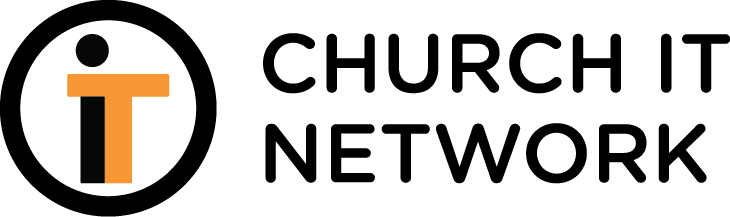
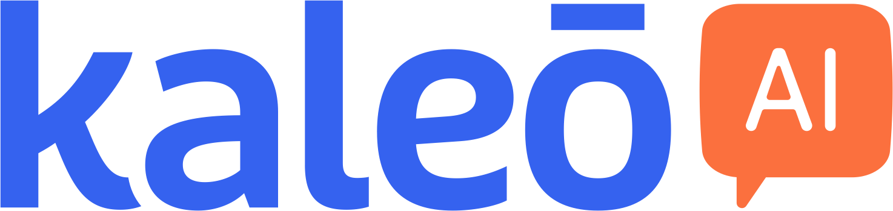
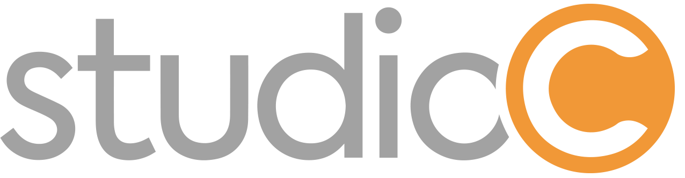
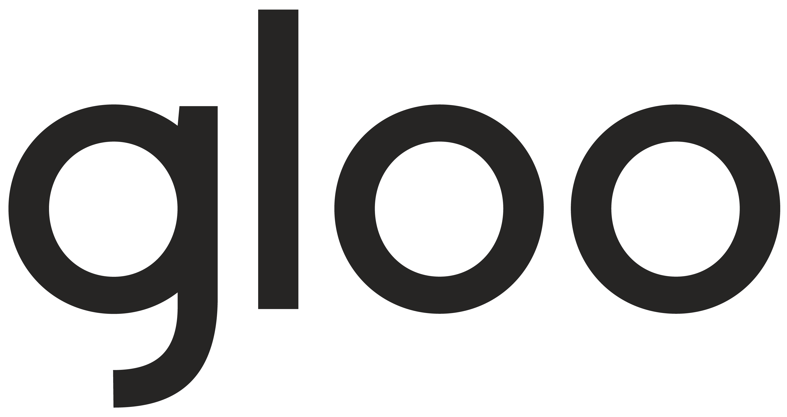
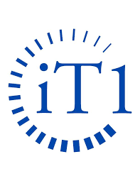

# AI Context Engineering Workshop

### Workshop Schedule — Peoria, IL — May 7-8, 2026

---

> **Working draft.** This agenda is a starting point for refinement. Session lengths, ordering, and titles will change as we lock in content.

## At a Glance

| | Day 1 — Foundations (May 7) | Day 2 — Build Day (May 8) |
|---|---|---|
| **Theme** | Learn the mindset, the workflow, and how to build context | Apply it end-to-end: plan, build, and ship a Next.js app |
| **Format** | Concepts + short hands-on exercises | Guided build with checkpoints |

Both days run **9:00 AM – 5:00 PM** with a **75-minute lunch**, a **15-minute morning break**, and a **20-minute afternoon break (snacks provided).**

---

## Day 1 — Foundations (May 7)

| Time | Duration | Session |
|---|---|---|
| 9:00 – 9:30 | 30 min | **Welcome & Kickoff** — introductions, goals for the two days, verify everyone's setup from the [prerequisites guide](../_requirements/README.md) |
| 9:30 – 10:15 | 45 min | **Vibe Coding vs. Context Engineering** — what the difference is, why it matters, what "good" looks like |
| 10:15 – 10:30 | 15 min | ☕ Morning break |
| 10:30 – 11:30 | 60 min | **SDLC Crash Course** — git, VS Code, terminal, repos, commits, branches. Light but enough to participate confidently the rest of the workshop |
| 11:30 – 12:30 | 60 min | **Building the Context for Context Engineering — Part 1** — `CLAUDE.md`, requirements docs, conventions, how to write for an LLM audience |
| 12:30 – 1:45 | 75 min | 🍽 Lunch |
| 1:45 – 2:45 | 60 min | **Building the Context for Context Engineering — Part 2** — hands-on: authoring context for a sample project, critique, iterate |
| 2:45 – 3:45 | 60 min | **The Plan / Review / Execute / Test Workflow** — the core loop, when to use each phase, what each phase produces |
| 3:45 – 4:05 | 20 min | 🍎 Afternoon break + snacks |
| 4:05 – 4:45 | 40 min | **Choosing Your Medium** — web, mobile, desktop (Win/Mac), service, agents. Tradeoffs and when to pick what |
| 4:45 – 5:00 | 15 min | **Day 1 Wrap** — what to come back ready to build tomorrow |
| 6:30 PM | — | 🍴 Dinner (provided) |

---

## Day 2 — Build Day (May 8)

| Time | Duration | Session |
|---|---|---|
| 9:00 – 9:30 | 30 min | **Day 2 Kickoff** — pick your project, framing for the build, what "done" looks like by 5 PM |
| 9:30 – 10:30 | 60 min | **Next.js with Claude Code** — scaffolding, establishing project-level context, the first few prompts |
| 10:30 – 10:45 | 15 min | ☕ Morning break |
| 10:45 – 12:30 | 105 min | **Build Block 1 — Plan & Review** — requirements, architecture, data model, review before writing code |
| 12:30 – 1:45 | 75 min | 🍽 Lunch |
| 1:45 – 3:15 | 90 min | **Build Block 2 — Execute & Test** — implement features, iterate, validate against the plan |
| 3:15 – 3:35 | 20 min | 🍎 Afternoon break + snacks |
| 3:35 – 4:30 | 55 min | **Deploying to Vercel** — from local to live, environment config, common gotchas |
| 4:30 – 5:00 | 30 min | **Show & Tell / Closing** — share what you built, Q&A, where to go next |
| 6:30 PM | — | 🍴 Dinner (provided) |

---

## Open Questions for Refinement

- Is 60 min enough for the **SDLC crash course** given the audience is mostly new to it, or does it need 90?
- Should the **medium comparison** (web/mobile/desktop/service/agents) live on Day 1 where it is now, or move to Day 2 morning so attendees pick their Day 2 project with it fresh?
- For Day 2, do we want everyone building the **same reference app** or do we let each attendee bring their own idea?
- Are there any real ministry scenarios we want to anchor the Day 2 build around (volunteer signup, event check-in, giving dashboard, etc.)?
- Do we need a short **prompt/context review** slot on Day 2 morning to debug setups before the build starts?

---

<strong>Made possible by our partners</strong>

  
  &nbsp;&nbsp;&nbsp;&nbsp;
  
  &nbsp;&nbsp;&nbsp;&nbsp;
  
  &nbsp;&nbsp;&nbsp;&nbsp;
  
  &nbsp;&nbsp;&nbsp;&nbsp;
  
  &nbsp;&nbsp;&nbsp;&nbsp;
  
  &nbsp;&nbsp;&nbsp;&nbsp;
  
  &nbsp;&nbsp;&nbsp;&nbsp;
  

